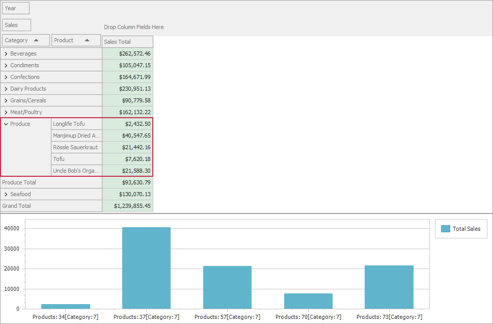

<!-- default badges list -->

<!-- default badges end -->

# WinForms - Customize Pivot Grid Data before Displaying it in the Chart Control

The following example demonstrates how to add custom text to the Pivot Grid's data used as the data source for the Chart control. The Pivot Grid supplies data to the attached Chart control in the form of a simple table. In the image below, the Chart axis labels display the number of unique values that are stored in the underlying data source in the _Product Name_ and _Categoty_ fields.

## Files to Review
<!-- default file list -->
[Form1.cs](./CS/Form1.cs) (VB: [Form1.vb](./VB/Form1.vb))
<!-- default file list end -->

## Documentation

[Integrate the Pivot Grid with the Chart Control](https://docs.devexpress.com/WindowsForms/8748/controls-and-libraries/pivot-grid/data-analysis/integration-with-the-chart-control)

## More Examples 
- [WinForms - How to visualize Pivot Grid Data in the Chart Control](https://github.com/DevExpress-Examples/winforms-visualize-pivot-grid-data-in-chart)
- [WinForms - How to Hide Unnecessary Series from the Chart (Pivot Grid - Chart Integration)](https://github.com/DevExpress-Examples/winforms-pivot-chart-integration-hide-unnecessary-series-from-the-chart)
- [WinForms - Print a Document that Contains Pivot and Chart Controls](https://github.com/DevExpress-Examples/winforms-print-pivot-and-chart-controls)
